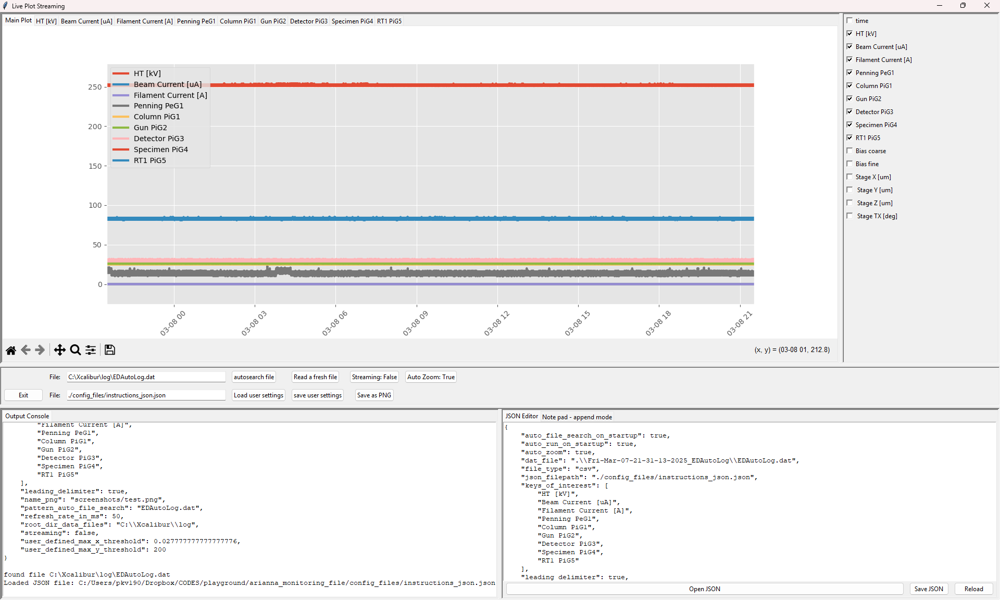

The data_tracker is a (currently) python based app that is intended to be flexible both in terms of adaptability by a user in a folder "user_scripts" and also in defining the GUI layout by independent components, and had its initial purpose as live streaming and plotting data of an electron diffractometer output.

Currently, it is structured as a tkinter gui. To make the design less object oriented, a dictionary that handles global variables and GUI elements is employed. Also, this is a test ground for employing some design patterns, all with the aim of making components exchangable.

It is still actively worked upon and not yet ready to be shipped widely.

Currently based on a pandas data frame as standardized data interchange format. This could also be solved by an hdf5 or other ways, depending on the chosen data loading and presentation format.

Standalone version are available at:

